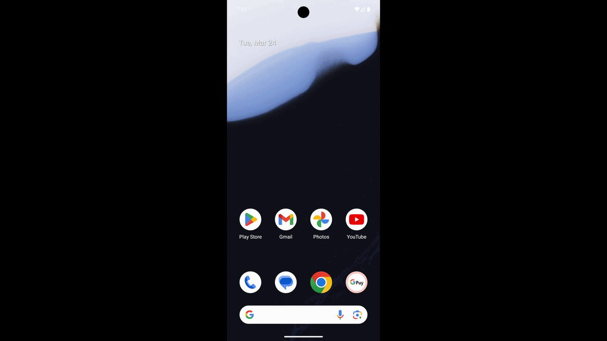
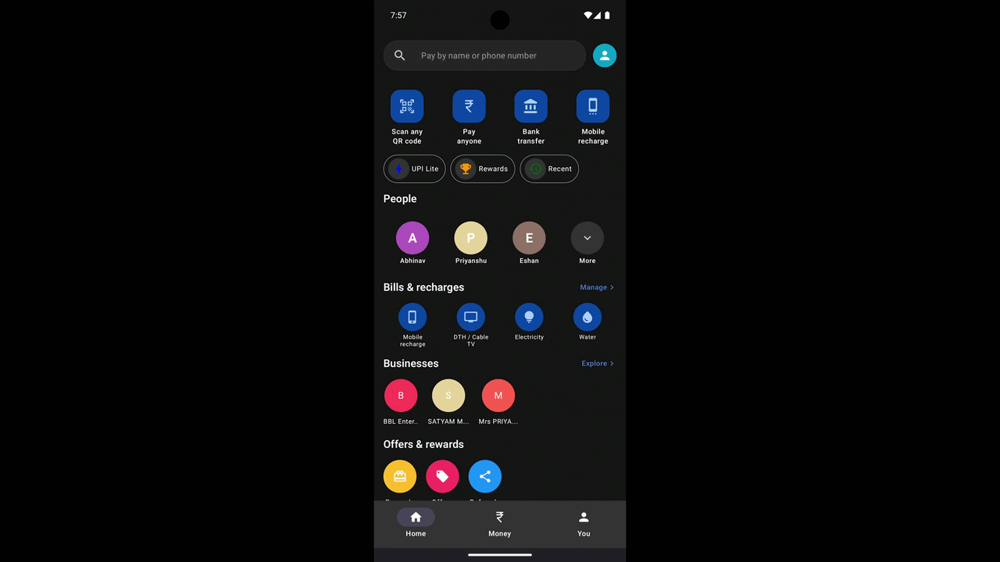

# 💳 Google Pay UI Clone - Jetpack Compose

A high-fidelity UI clone of the Google Pay application built entirely with **Jetpack Compose**. This project was developed to practice advanced UI patterns, complex animations, and seamless theming in modern Android development.

---

## 📱 Visual Showcase

| Theme & Dynamic UI | Share Feature & List Animations |
|:---:|:---:|
|  |  |
| *Dark/Light mode transition* | *People section & Share Intent* |

---

## ✨ Key Features

### 🎨 Adaptive Theming
- **Full Dual-Theme Support:** Implemented comprehensive Light and Dark modes using Material 3 `ColorScheme`.
- **Seamless Switching:** The UI responds instantly to system-level theme changes without layout breaking.

### 🔍 Advanced Animations
- **Animated Search Bar:** The search field features a cycling placeholder ("Pay by name", "Pay by phone") using `AnimatedContent` for a smooth vertical slide transition.
- **People Section:** Smooth entry and interaction animations for the contact list, mimicking the fluid feel of the original Google Pay app.

### 💳 Transaction Management
- **Detailed Receipts:** A dedicated Transaction Detail Screen that pulls data dynamically.
- **Native Sharing:** Integrated Android **Intent system** allowing users to share transaction summaries (Amount, Date, Status) as plain text to other apps (WhatsApp, Messages, etc.).

### 🧭 Navigation & UX
- **Compose Navigation:** Robust screen-to-screen transitions and argument passing.
- **Material 3 Components:** Utilization of modern TopAppBars, BottomNavigationBars, and specialized Surface elevations for better depth.

---

## 🛠️ Tech Stack

- **Language:** Kotlin
- **Toolkit:** Jetpack Compose (1.7+)
- **Design System:** Material Design 3
- **Navigation:** Jetpack Compose Navigation
- **Icons:** Material Icons Extended
- **Animation:** Compose Animation (AnimatedContent, LaunchedEffect, Tween)

---

## 📥 Test the App

You can download the latest stable APK to test the UI on your own device:

🚀 **[Download APK from Google Drive](https://drive.google.com/file/d/1RAFYG-D9Y4ov09A9w2U0WmCwvoUH5vU3/view?usp=sharing)**

> **Installation Note:** 
> 1. Download the APK.
> 2. Enable "Install from Unknown Sources" if prompted.
> 3. Launch and explore!

---

## 📂 Project Structure

- `ui/theme`: Custom Color, Type, and Theme definitions for Light/Dark modes.
- `ui/screens`: Composable functions for Home, Search, and Transaction Details.
- `ui/model`: Data classes for `PaymentDetail`, `PaymentStatus`, and `Person`.
- `screenshots/`: Contains the visual documentation (`theme.gif`, `share.gif`).

---

*Developed for UI/UX practice by [Ankit](https://github.com/Ankit6321/)
